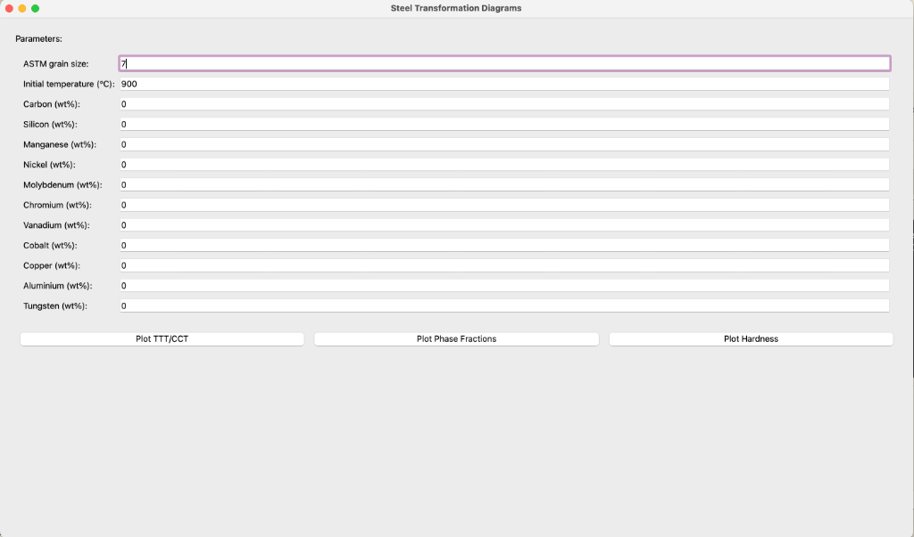
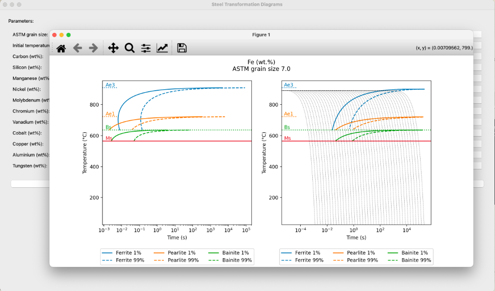
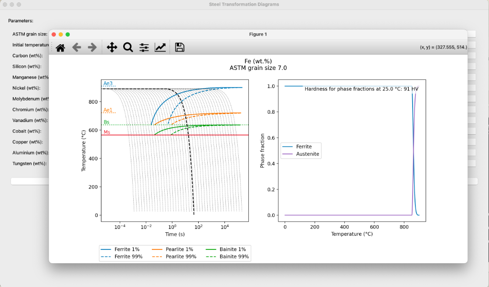
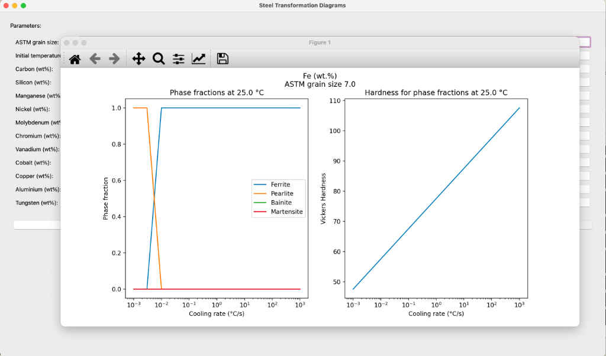

# Application Screenshots

## Main Interface

*Figure 1: Main application interface showing input parameters and control buttons*

## TTT/CCT Diagrams

*Figure 2: TTT (left) and CCT (right) diagrams showing transformation curves for Ferrite, Pearlite, and Bainite phases*

## Phase Fractions

*Figure 3: Phase fraction analysis showing the transformation of Austenite to Ferrite with temperature*

## Hardness Analysis

*Figure 4: Phase fractions and hardness variation with cooling rate*

## Key Features Shown in Screenshots

### Input Parameters (Figure 1)
- ASTM grain size input
- Initial temperature setting
- Chemical composition fields for 11 elements
- Three main control buttons for different plots

### Transformation Diagrams (Figure 2)
- Clear visualization of critical temperatures (Ae3, Ae1, Bs, Ms)
- Transformation curves for different phases
- Both 1% and 99% transformation lines
- Time scale in logarithmic format
- Temperature scale in Celsius

### Phase Analysis (Figure 3)
- Combined TTT/CCT diagram with phase fractions
- Clear visualization of transformation kinetics
- Hardness prediction at room temperature

### Hardness Plots (Figure 4)
- Phase fraction evolution with cooling rate
- Hardness variation across different cooling rates
- Clear legend and axis labels
- Interactive plot controls
